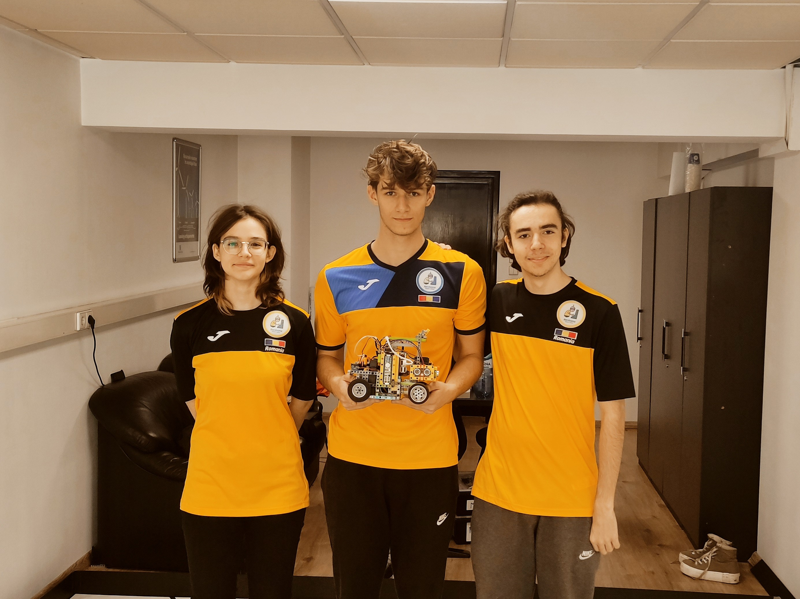
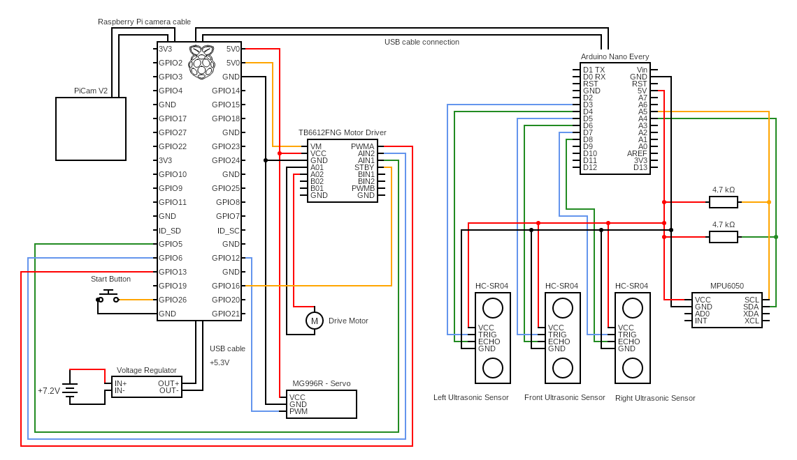

# Nerdvana Nemesis

### Team: Antonia Onisoru, Teodor Balan, Mihai Priboi
  

## Our video of the robot on [Youtube](https://youtu.be)

## Repository content
  - The "Final" folder contains the final code for the final stage
  - The "Qualifing" folder contains the final code for the qualification stage
  - The "Electrical Diagram" folder contains a schematic of the electromechanical representation of the robot
  - The "3D_models" folder contains 3D models for printing the robot
  - The "Robot Photos" folder contains the robot photos required by the regulation
  - The "Team Photos" folder contains the team photos required by the regulation

## Introduction
  We have been participating at WRO for the last couple of years, but 2022 was the first year when, in our country, Romania, Future Engineers was held. When we first started thinking about how to build our robot, we realized that it was not going to be the same as we were used to. 
  
  It was clear to us that lego electronics weren't going to be good enough for what we wanted, so we decided to use Raspberry Pi and Arduino so we could use cameras and other sensors. Since the Arduino is better for sensors, but we could only use a Raspberry Pi for a camera, we decided to use both, in serial communication. As for connecting all the pieces, we still used lego pieces with 3D-printed parts for the non-lego components. In this way, we have a modular robot, easy to modify, so it was simple to try different mechanisms during the year. 

  For the national competition, we came up with the idea of using an Arduino to measure distances with 2 ultrasonic sensors, and a Raspberry pi to identify the cubes with a camera, and also control the drive and steering motors. We have constructed the robot so it has rear-wheel drive with frontal steering.
  
   After we qualified for the international, we started making some changes, such as trying to make the robot faster and more constant. So we added a gyroscope sensor, and an ultrasonic sensor in the front and made the robot smaller. Also, we upgraded from an Arduino Uno to an Arduino Nano Every, because it has more interrupt pins. In addition, we tried changing the drive motor to a micromotor in order to make it faster. Unfortunately, even though it made the robot much faster, we fried the ones we tested. We believe it happened because the robot was too heavy for the motor, causing it to overheat and eventually fry it.

## Photos our robot Paula (**P**retty **A**wesome **U**ltra **L**ow **A**ccurate robot)
|  |  | 
| :--: | :--: | 
| *Front* | *Back* |
|  |  | 
| *Left* | *Right* |
|  |  | 
| *Top* | *Bottom* |

## Electrical diagram
  

## Building the robot
  The structure of the robot is made out of lego pieces and 3D printed parts, which we designed. All the 3D printed parts are made to hold the electrical components that we couldn't mount with lego pieces.
  
  Since the battery pack is the heaviest part, we positioned it at the back of the robot to put as much force on the drive wheels. Everything is as low as possible to increase stability.
  
  The Raspberry Pi and the prototype PCB board are mounted on a bigger 3D printed part, positioned in the middle, used to connect the front and back of the robot. The Arduino is also zip tied on the same part. Additionally, in the middle, on the side, there is a "control board" with the start button and a few LEDs.
  
  As for the steering and differential systems, they are made out of lego pieces. The MPU6050 gyro sensor needs to be firmly secured, however its position on the robot is not important. In the front there are the 3 ultrasonic sensors facing left, front and right, and the servo motor, right above the steering system.
  
  Last but not least, the camera is placed high up in order to see as much as possible of the map, and to the front so it doesn't see other parts of the robot.

### The components we are currently using are:
  - Raspberry Pi 3B
  - Arduino Nano Every
  - SparkFun Motor Driver - Dual TB6612FNG
  - Hobby Gearmotor
  - MG966R Servo Motor
  - 3 x HC-SR04 Ultrasonic Sensors
  - MPU6050 Accelerometer and Gyroscope Sensor
  - PiCam V2
  - DC-DC Voltage Converter (To convert the 7.2V from the powersource to 5.3V for the Raspberry Pi)
  - 6 x AA 1.2V Acumulators

## Code for the components
### Motor driver
```python
import RPi.GPIO as GPIO

GPIO.setmode(GPIO.BOARD)
GPIO.setwarnings(False);

# Pin numbers
PWMA = 33
AIN1 = 29
AIN2 = 31
STBY = 36

# Pin setup
GPIO.setup(PWMA, GPIO.OUT)
GPIO.setup(AIN2, GPIO.OUT)
GPIO.setup(AIN1, GPIO.OUT)
GPIO.setup(STBY, GPIO.OUT)

# Initialisation
pwmFreq = 100
pwma = GPIO.PWM(PWMA, pwmFreq)
pwma.start(100)

# Functions
def motorStart(speed):
    GPIO.output(STBY, GPIO.HIGH);
    in1 = GPIO.HIGH
    in2 = GPIO.LOW

    if(speed < 0):
        speed = speed * -1
        in1 = GPIO.LOW
        in2 = GPIO.HIGH

    GPIO.output(AIN1, in1)
    GPIO.output(AIN2, in2)
    pwma.ChangeDutyCycle(speed)

def motorStop():
    GPIO.output(STBY, GPIO.LOW)
```
### Servo
```python
from gpiozero import Servo
from gpiozero.pins.pigpio import PiGPIOFactory

factory = PiGPIOFactory()

# Pin numbers
SERV = 12  # GPIO pin!

# Initialisation
servo = Servo(SERV, min_pulse_width=1.03/1000, max_pulse_width=1.97/1000, pin_factory=factory)

# Functions
def clamp(val, small, big):
    return max(small, min(val, big))

def moveServo(angle):
    servoCorrection = 0.04
    angle = clamp(angle, -1 + servoCorrection, 1 - servoCorrection)
    angle += servoCorrection
    servo.value = angle
```
### Camera
```python
import cv2
import numpy as np
from picamera.array import PiRGBArray
from picamera import PiCamera

IMAGE_WIDTH = 320
IMAGE_HEIGHT = 240

camera = PiCamera()
camera.resolution = (IMAGE_WIDTH, IMAGE_HEIGHT)
camera.framerate = 40

try:
    rawCapture = PiRGBArray(camera, size=(IMAGE_WIDTH, IMAGE_HEIGHT))

    for frame in camera.capture_continuous(rawCapture, format="bgr", use_video_port=True):
        image = frame.array
        img = imgProcc(image)
        cv2.imshow("Frame", img)

        key = cv2.waitKey(1) & 0xFF
        # clear the stream in preparation for the next frame
        rawCapture.truncate(0)
        # if the `q` key was pressed, break from the loop
        if key == ord("q"):
            break
```
### Arduino connection
```python
import serial
import time
from threading import Thread
import sys

arduino_read = ""
def arduinoReceving(ser):
    global arduino_read, endProgram
    while endProgram == False:
        if ser.in_waiting > 0:
            arduino_read = ser.readline().decode('utf-8', 'ignore').rstrip()
            arduino_read = arduino_read
            print("raw: " + arduino_read) 

def readSensors():
    global arduino_read
    sensor = arduino_read.split()
    if len(sensor) > 1:
        return (int(sensor[0]), int(sensor[1]), int(sensor[2]), float(sensor[3]))
    else:
        return (0, 0, 0, 0)
    
def startSerial(tries):
    ser = serial.Serial('/dev/ttyACM0', 115200, timeout=1)
    time.sleep(0.1)
    ser.reset_input_buffer()
    time.sleep(0.1)
    ser.write(b"\n")
    time.sleep(0.1)
    if ser.in_waiting > 0:
        tries += 1
        if tries == 2:
            return ser
    
    ser.close()
    print("Serial communcation failed!")
    return startSerial(tries)

try:
    ser = startSerial(0)
    print("Serial communcation ok!")
    Thread(target=arduinoReceving, args=(ser,)).start()
    time.sleep(3.5)
```
### Ultrasonic
```ino
#include "HC_SR04.h"

#define TRIG_PIN 3
#define ECHO_PIN 4

HC_SR04 sensor(TRIG_PIN, ECHO_PIN, digitalPinToInterrupt(ECHO_PIN));

long startTime, interval = 75;

void setup() {
  Serial.begin(115200);

  while(Serial.available() == 0);

  delay(10);
  Serial.println("ok!");

  sensor.begin();
  sensor.start();
  startTime = millis();
}

void loop() {
  if(millis() - startTime > interval) {
    if(sensor.isFinished()) {
      Serial.println(sensorLeft.getRange());
      sensor.start();
    }
    startTime = millis();
  }
}
```
### MPU6050 Gyro
```ino
#include <MPU6050_tockn.h>
#include <Wire.h>

MPU6050 mpu6050(Wire);

long startTime, interval = 75;

void setup() {
  Serial.begin(115200);

  while(Serial.available() == 0);

  delay(10);
  
  Wire.begin();
  Wire.setTimeout(true);
  
  mpu6050.begin();
  Serial.println("ok!");
  mpu6050.calcGyroOffsets(false);

  //mpu6050.setGyroOffsets(-34, 2.17, 0.63);
  
  Serial.println("ok!");
  
  startTime = millis();
}

void loop() {
  mpu6050.update();
  
  if(millis() - startTime > interval) {
    Serial.println(mpu6050.getGyroAngleX());
    startTime = millis();
  }
}
```

## How to run our code
  - To program the robot you need to connect to the Raspberry pi either with a monitor or capture card using a HDMI cable or Wirelessly using VNC Viewer, a computer app we used so we could work without the bother of a cable.
  - The first step to running the code is to set up and install all the libraries necessary for the camera, image processing, and serial communication by using the Rasberry Pi terminal. To do that you must follow the instructions below: 
    - Open the terminal and update the Raspberry Pi OS by typing the following line:
    ```
    sudo apt-get update
    sudo apt-get upgrade
    ```
    - Then, after you finished updating the Raspberry Pi OS, open the configurations by running the following  commands:
    ```
    sudo raspi-config
    ```
    - Now, in the interfacing options, you need to enable the Camera and I2C.
    - After, enabling the Camera and I2C, we go back to installing libraries. Open the terminal again and type the commands below:
    ```
    sudo apt-get install python3-pip
    sudo pip-3.2 install picamera
    sudo pip-3.2 install picamera
    sudo apt-get install libopencv-dev
    sudo apt-get install libatlas-base-dev
    sudo pip3 install virtualenv Pillow numpy scipy matplotlib
    sudo pip3 install opencv-python opencv-contrib-python
    sudo apt-get install python-serial
    sudo pip3 install gpiozero
    sudo apt-get install rpi.gpio
    ```
    - Last but not least, you need to reboot the Rasberry Pi.
  - In addition,  you can install the Arduino IDE on the Rasberry Pi, so you can upload the C++ code easier. Therefore, you don't have to switch between the two boards to run and change the C++ code, if you need to. Also, the IDE has a friendly user interface and it's well documented on the internet.
  - Now that everything is installed you should be able to run the main program on the Raspberry Pi. So all that is left for you to do is to open the terminal, go into the folder in which the program is located, and execute the .py file. You can do that with commands such as:
  ```
  cd "folder"
  python "file".py
  ```
  -  While the Arduino starts the program by itself when it is powered on, the Raspberry Python code has to be set to start up on power on

## Starting the robot
 - Turn on the robot with the switch on the battery pack
 - Place the robot on the track
 - Wait for about 8 seconds for the gyro to stabilize and camera to start
 - Press the start button

## Our future plans
  With our failed attempt to change the drive motor for a higher speed, that is one of our most important future task. We hope that by trying to use a bigger motor, or even better, making the robot smaller and lighter, we can increase our speed.
  
  The Raspberry Pi is great for what it was designed for: being a small computer. But, for this task, what is needed is speed and accuracy, and a microcontroller is all we need. We used a Raspberry Pi to process what the camera sees, and an Arduino for the sensors. However, good communication between the two is difficult and problematic. Fortunately, we found some camera modules that include processing, which could be directly read by a microcontroller like Arduino, so we wouldn't need a Raspberry Pi. We hope to test this solution as soon as possible because we believe that running everything on a single board (preferably a very fast one), will increase the accuracy of the data we process and the movement that the robot makes. Moreover, even if it isn't a big deal, programming would be easier, changing the code on only the microcontroller, and not having to connect to the Raspberry Pi.
  
  Making the robot smaller is also important. It means higher speed, easier maneuvering, and much better efficiency in general. That being said, we believe that made out of legos, it is very close to being as small as possible, so we plan to design almost all of it and 3D print it. It has always been a plan for us, but we needed to be sure that the layout for everything is optimal.
