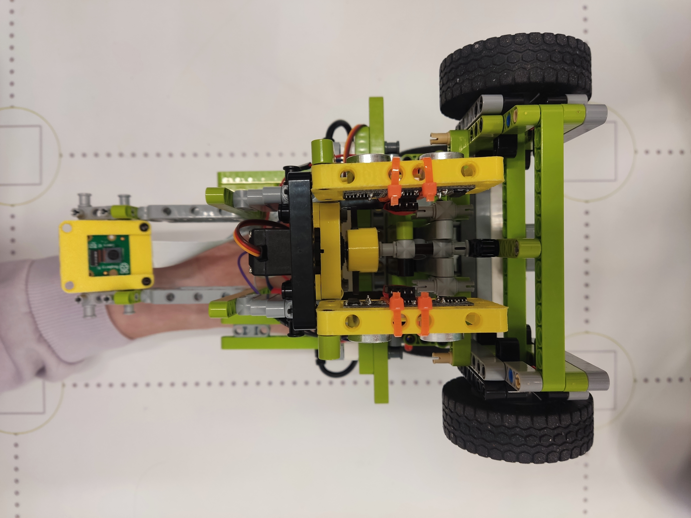
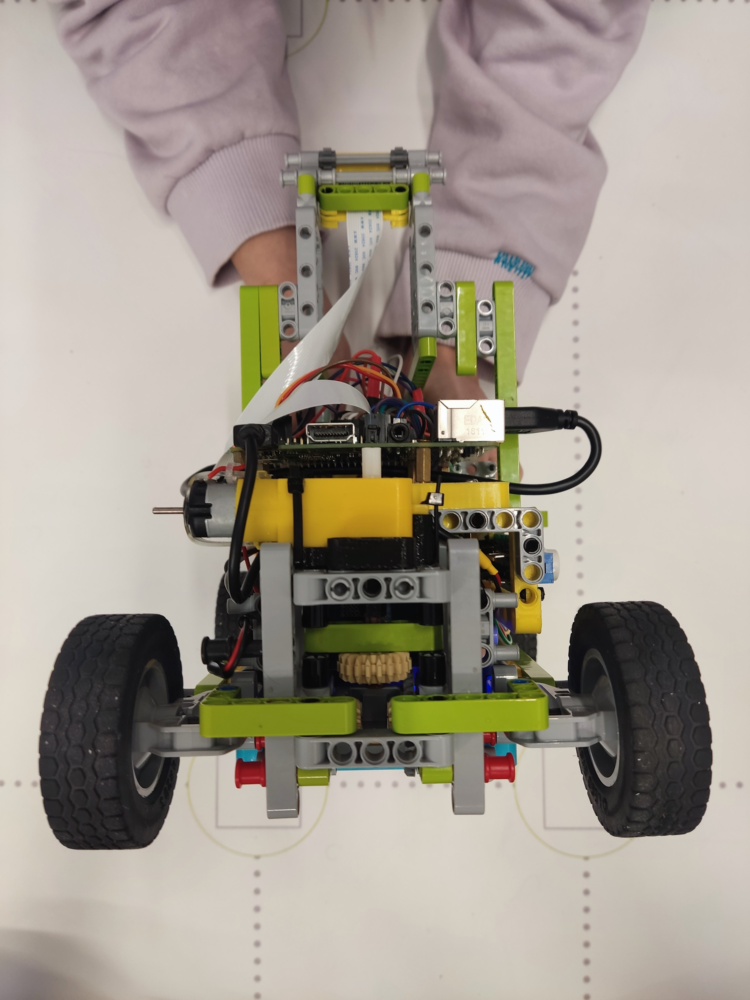
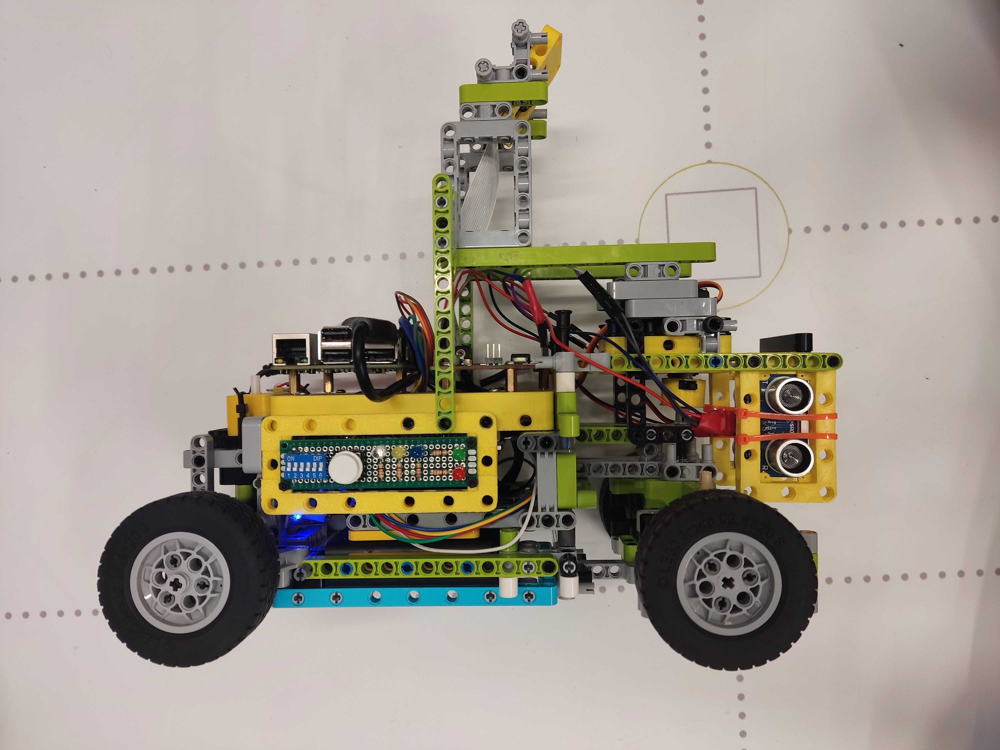
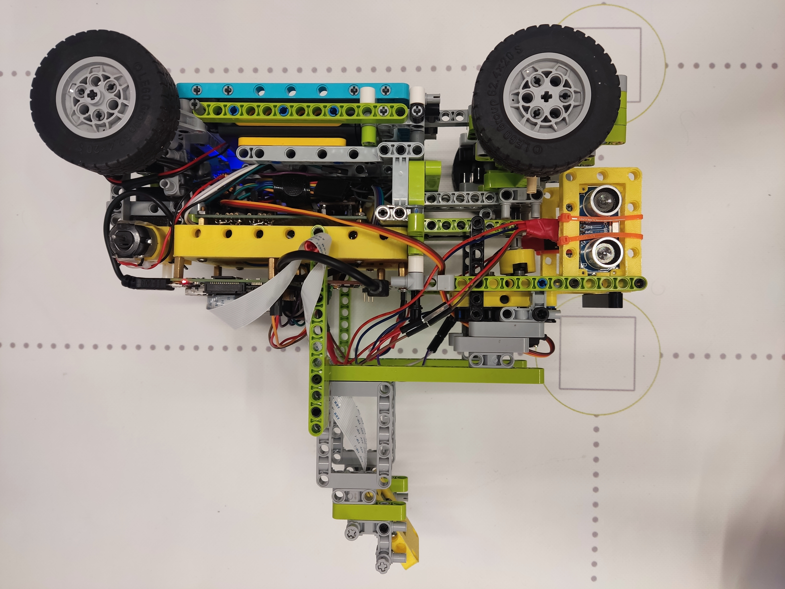
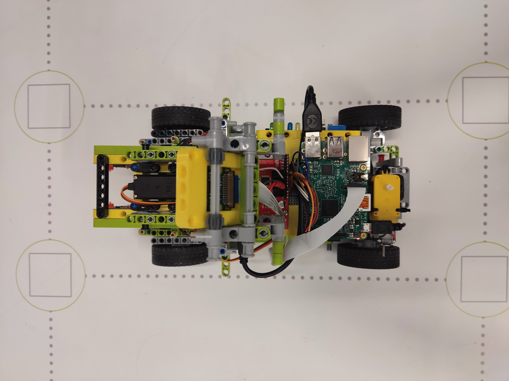
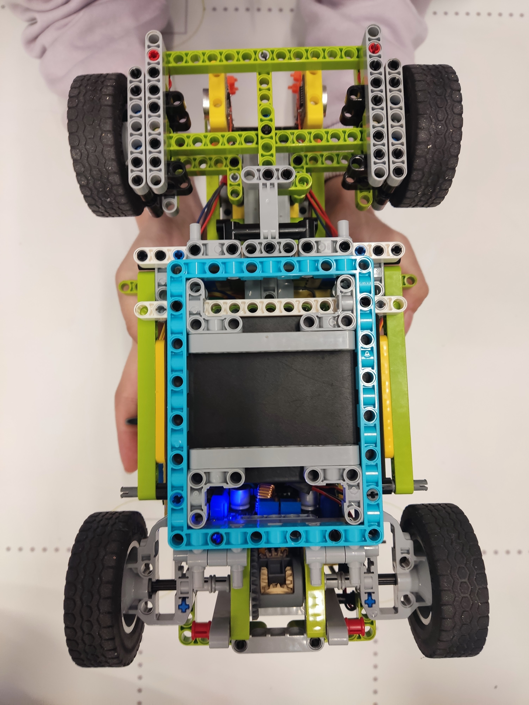

# Nerdvana Nemesis

### Team: Antonia Onisoru, Teodor Balan, Mihai Priboi
  

 

## Our video of the robot on [Youtube](https://youtu.be)
## Introduction
  

## Repository content
  - The "Final" folder contains the final code for the final stage
  - The "Qualifing" folder contains the final code for the qualitication stage
  - The "Electrical Diagram" folder contains a schematic of the electromechanical representation of the robot
  - The "3D_models" folder contains 3D models for printing the robot
  - The "Robot Photos" folder contains the team photos required by the regulation

## Photo of the robot
  
  
  
  
  
  

## Electrical diagram
  
  

### Building the robot
  We have been participating at WRO for the last couple of years, but 2022 was the first year when in our country, Romania, Future Engineers was held. When we first started thinking about how to build our robot, we realised that it was not going to be the same as we were accustomed to. 
  
  It was clear to us that lego electronics weren't going to be good enough for what we wanted, so we decided to use Raspberry pi and Arduino so we could use cameras and other sensors. Since the Arduino is better for sensors, but we could only use a Raspberry pi for a camera, we decided to use both, in a serial communication. As for connecting all the pieces together, we still used lego pieces with 3D printed parts for the non-lego components. In this way, we have a modular robot, easy to modify, so it was easy to try different mechanisms during the year.  

  In the end, we came up to the ideea of using an Arduino to read 2 ultrasonic sensors, and a Raspberry pi to identify the cubes with a camera, and control the drive and steering motors. We have constructed the robot so it has a rear wheel drive with frontal steering.  

### The components we are currently using are:
  - Raspberry pi 3b
  - Arduino Uno
  - SparkFun Motor Driver - Dual TB6612FNG
  - Hobby Gearmotor
  - MG966R Servo Motor
  - 2 HC-SR04 Ultrasonic Sensors
  - PiCam V2
  - DC-DC Voltage Converter (To convert the 7.2V from the powersource to 5.3V for the Raspberry pi)
  - 6 AA 1.2V Acumulators

## How to run our code

  - To program the robot you need an to connect to the Raspberry pi either with a monitor using a HDMI cable or Wirelessly using VNC Viewer, a computer program we used so we could work without the bother of a cable.
  - On the Raspberry pi you need to install the Arduino IDE to upload the C++ code to the Arduino, the IDE has a friendly user interface and it's very documented on the internet
  - To run the main program on the raspberry, you need a Python IDE like Thonny, make a Python program and run it in the terminal. While the Arduino starts the program by itself when it is powered on, the Raspberry Python code has to be set to start up on power on

## Starting the robot

 - Turn on the robot with the switch on the battery pack
 - Place the robot on the track
 - Press the start button

## Our future plans
